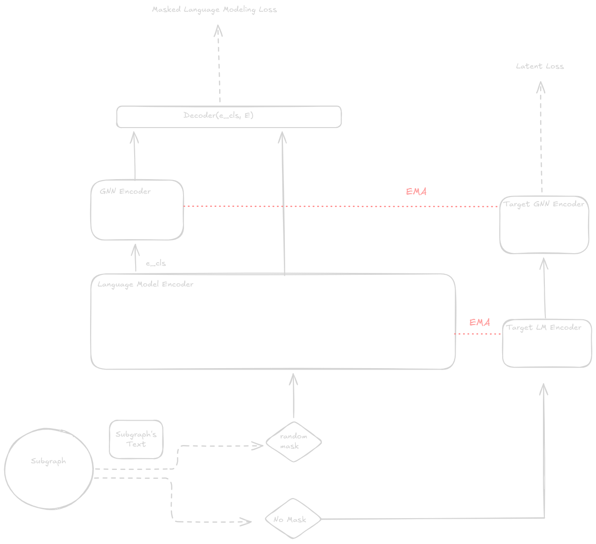

# TGFM

Text-Graph Foundation Model

## Getting Started

### Prerequisites

The project uses [uv](https://docs.astral.sh/uv/) to manage and lock project dependencies for a consistent and reproducible environment. If you do not have `uv` installed on your system, visit [this page](https://docs.astral.sh/uv/getting-started/installation/) for installation instructions.

**Note**: If you have `pip`, you can invoke:

```sh
pip install uv
```

### Installation

```sh
# Clone the repo
git clone git@github.com:sebastian9991/TGFM.git

# Enter the repo directory
cd TGFM

# Install core dependencies into an isolated environment
uv sync

# The isolated env is .venv, you may source it like so:
source .venv/bin/activate
```

### Running mini-batching with PyG's loaders:

Given the size of our datasets we must leverage mini-batching in our GNN experiments. To do this we use PyG's `neighbor_loader`,
which requires additional libraries having undocumented build-time dependencies. As such, users are required to install them in their
own venv. seperate from `uv sync`.

PyTorch Sparse, Scatter and pyg-lib:

```sh
uv pip install pyg-lib torch-scatter torch-sparse -f https://data.pyg.org/whl/torch-2.11.0+cu128.html
```

For more information on installations of these additional libraries see [pyg-lib](https://github.com/pyg-team/pyg-lib) and [PyTorch Sparse](https://github.com/rusty1s/pytorch_sparse).

## Usage

All experiment scripts will include an argument which points to a configuration file defining experimental, data and model arguments. As well as Meta arguments for constant values paths, seeds, etc. Here is an example:

```sh
MetaArguments:
  log_file_path: "unigraph_ogb_pretraining.log"
  root_dir: "ogb_100m/"
  is_scratch_location: true
  global_seed: 42

ExperimentArguments:
  exp_args:
    Unigraph:
      model_args:
        model: "Unigraph"
        num_layers: 3
        num_neighbors: [4, 2, 1]
        batch_size: 16
        dropout: 0.2
        lr: 2.0e-5
        weight_decay: 0.001
        device: 0
      data_args:
        task_name: "pre-training"
```

For more information on the arguments check: [args.py](tgfm/utils/args.py)

### Pre-Training

Due to the scale of the graph datasets and text attributes that come with them we recommend pre-training this in a distributed setup, with multiple nodes and GPUs. Here is an example launch script:

#### Unigraph

### Model



```sh
#!/bin/bash
#SBATCH --nodes=x
#SBATCH --ntasks-per-node=1
#SBATCH --mem=400G
#SBATCH --job-name=unigraph-pretrain

set -e
echo "Date:     $(date)"
echo "Job ID:   $SLURM_JOB_ID"
echo "Nodes:    $SLURM_JOB_NODELIST"


echo "Attempt: #${SLURM_RESTART_COUNT:-0}"

export MASTER_ADDR=$(scontrol show hostnames "$SLURM_JOB_NODELIST" | head -n 1)
export MASTER_PORT=$(expr 10000 + $(echo -n $SLURM_JOBID | tail -c 4))

echo "Master: $MASTER_ADDR:$MASTER_PORT"
echo "Slurm Nodes: $(($SLURM_NNODES))"

# Note the bash -c wrapper so SLURM_NODEID is evaluated in each task.
srun --gres-flags=allow-task-sharing bash -c "
    uv run torchrun \
        --nnodes=\$SLURM_NNODES \
        --node_rank=\$SLURM_NODEID \
        --nproc_per_node=\$SLURM_GPUS_ON_NODE \
        --rdzv_endpoint=$MASTER_ADDR:$MASTER_PORT \
        --master_addr=$MASTER_ADDR \
        --master_port=$MASTER_PORT \
        tgfm/experiments/unigraph/pretraining.py \
        --config-file configs/unigraph/base.yaml
    "
```

### Memory Recommendations

You will need to accommodate the subgraph size depending on the defined max sequence length in your text storein order for the batches to fit in GPU memory.

Subgraph sizes are calculated based on the `batch_size` and `num_neighbor` model argument paramaters. Your actual subgraph batch size will be at most:

$$|n_id|_{\\max} = B \\cdot \\left(1 + \\sum_{\\ell=1}^{L} \\prod\_{i=1}^{\\ell} k_i\\right)$$

Where $$B$$ is your batch size, and $$k_i$$ is the ith neighbor in `num_neighbor`.

If you are willing to trade-off efficiency for lighter memory loads on the GPU, then consider enabling gradient checkpointing:

```sh
ExperimentArguments:
  exp_args:
    Unigraph:
      model_args:
        model: ""
        gradient_checkpointing: true
      data_args:
        task_name: "pre-training"
```

### Evaluation

We use a variety of popular text-attributed graph datasets for OOD experimentation. To prepare these datasets for evaluation we have included scripts to do so under the [evaluation data folder](data/evaluation_data).

For example with Cora:

```sh
uv run data/evaluation_data/cora/prepare_cora.py --output-dir path/to/output
```

After preparing each evaluation dataset

```sh
uv run tgfm/evaluation/evaluate_tags.py --config-file path/to/pretrain/config --text-store-dir path/to/evaluation/dataset
```

### Pre-Processing

Considering the size of these graph datasets and the added text-attributes, we utilize a memmory mapped text store, which allows us to load the text in memory only when needed. We've made available scripts process the OGB MAG240M into the format required.

#### OGB MAG240M

NOTE: You will need to download the text from [OGB](https://ogb.stanford.edu/docs/lsc/mag240m/)

```sh
#Get the graph data
uv run scripts/process_mag_dataset.py --root path/to/save/mag/graph/data

#Build the text-store
uv run scripts/process_mag_tokens.py --text-csv-path path/to/text/ --output-memmap-path path/to/resulting/memmap
```

#### CrediBench

NOTE: You will need to download the text from [CrediBench-RawText](https://huggingface.co/datasets/credi-net/CrediText/tree/main). Additionally, the vertices and edges from csv files found [here](https://huggingface.co/datasets/credi-net/CrediBench/tree/main)

We process the the parquet files using [nemo-curator](https://github.com/NVIDIA-NeMo/Curator) more information on the data processing can be found [here](https://huggingface.co/datasets/credi-net/CleanCDB).

```sh
#Text Cleaning
uv run tgfm/processing/text_cleaning/main.py --file-paths $SCRATCH/data/month/text_data/ --output-path $SCRATCH/data/month/text_data/cleaned_text/ --files-per-partition 1 --num-gpus 1

#Text Deduplication
uv run --active tgfm/processing/deduplication/main.py --file-paths $SCRATCH/data/month/text_data/cleaned_text/ --output-path $SCRATCH/data/month/text_data/deduplication/ --num-gpus 1


#Text Language Labelling
uv run --active tgfm/processing/language_extraction/main.py --file-paths $SCRATCH/data/month/text_data/deduplication/ --output-path $SCRATCH/data/month/text_data/language_extracted/ --fast-text-path fast_text/ --num-gpus 1
```

After which you can construct the text-store object and PyG Dataset:

```sh
uv run tgfm/processing/process_cdb/prepare_cdb_vertices.py --input-root $SCRATCH/path/to/raw --output-root $SCRATCH/path/to/processed

uv run tgfm/processing/process_cdb/prepare_cdb_edges.py --input-root $SCRATCH/path/to/raw --output-root $SCRATCH/path/to/processed --registry $SCRATCH/path/to/processed/domain_registry.parquet

uv run tgfm/processing/process_cdb/prepare_cdb_text_store.py --input-root $SCRATCH/path/to/raw --output-root $SCRATCH/path/to/processed --registry $SCRATCH/path/to/processed/domain_registry.parquet --tokenizer xlm-roberta-base --seq-len 512
```
